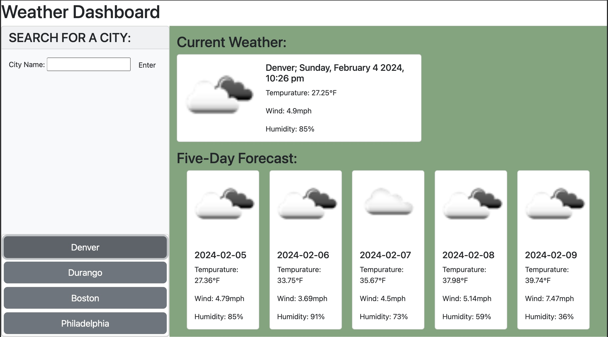

# Weather Dashboard

## Description
Use this Weather Dashboard to find out the weather in your favorite cities. Simply enter the name of the city into the search bar and press enter. The current weather will appear to the right, and the five-day forecast will appear below. Additionally, the searches you've made previously will appear underneath the search bar for convenient searching - just click the button, and the weather will appear!

## Usage
To start, enter the name of a city in the search bar and hit enter. The current weather for that city will appear on the right, and a five-day forecast will appear below it. Your searches will be saved, so that as you revisit the application, you will just have to click on the button below the search bar to see the weather for your favorite cities. 

See a screenshot for reference:

And a link to the deployed website: https://williamk31.github.io/Weather-Dashboard

## Contributors
Made by William Kalish using the OpenWeatherAPI: https://openweathermap.org/api
And Bootstrap: https://getbootstrap.com/
And Day.js: https://day.js.org/